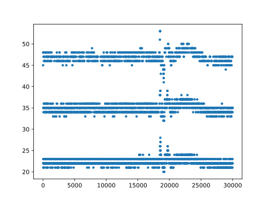
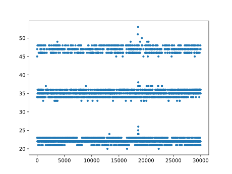

# flux-analyze
Analysis and recovery of IBM MFM floppy image data

This is where I experiment with methods to more reliably decode IBM MFM floppies
based on flux transition data.

Currently, mfm_decoder contains some functions for doing so, based on the .au
format that FluxEngine exposes through fluxtoau. The main idea is to use the
optimal 1D k-median algorithm of Grønlund et al. 2017 to separate different
clock tracks in the presence of noise. More info can be found in the source
files' comments.

To use, run mfm_decoder interactively in ipython, i.e. `ipython3 -i mfm_decoder.py`, then invoke `demonstrate("your-file.au")`

The tracks/ directory contains some sample tracks in FluxEngine and .au format.
The .au files are all compressed with bz2. (Uncompress before using.)

- low_level_format_with_noise: every sector is 0x00 or 0xF6. Some weird effects on the flux transitions in certain places. Useful for testing recovery ideas later, because the data pattern on the corrupted sectors is known.
- MS_Plus_OK_track - OK track from a Microsoft Plus! floppy. This one can be decoded fine with FluxEngine.
- MS_Plus_warped_track - Warped track from a Microsoft Plus! floppy. FluxEngine can't cleanly decode every sector, but mfm_decoder can.

## Experimental local dewarping

mfm_decoder also contains functions to do a sliding window k-medians-based
correction of jitter/warping. This makes sectors easier to read in some cases,
and could potentially recover data from fragile disks where every read counts.
However, it is slow at the moment.

`demonstrate()` demonstrates the dewarping functionality, and passing
`show_plot=True` will show some before-and after plots, like this:

Before:

After:

